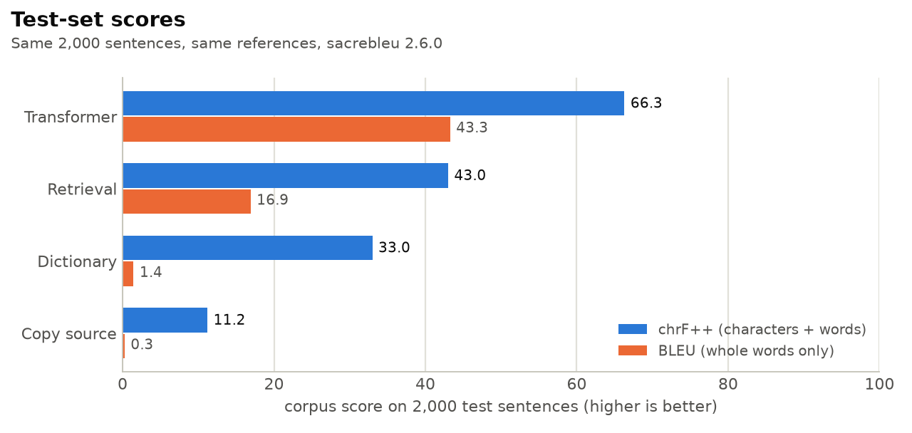
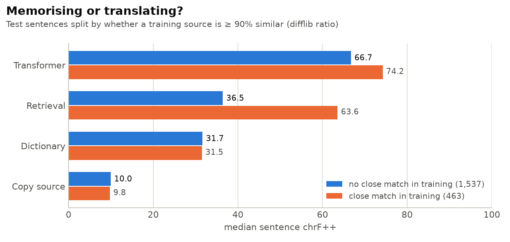
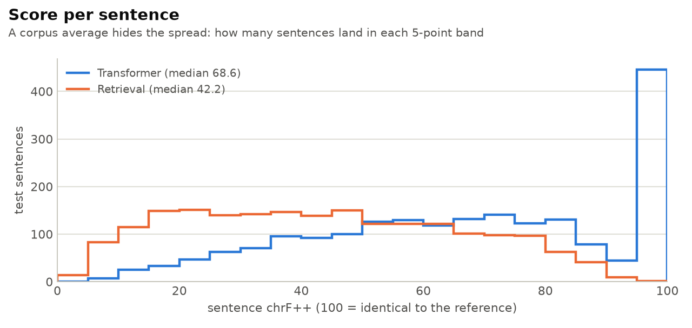
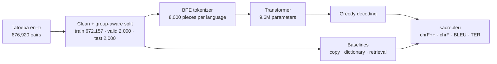
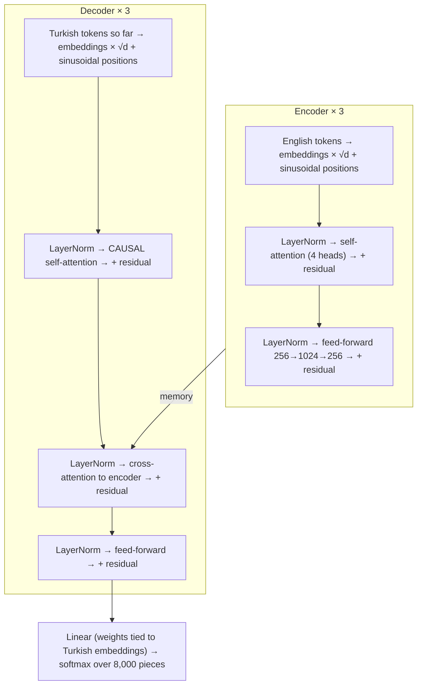
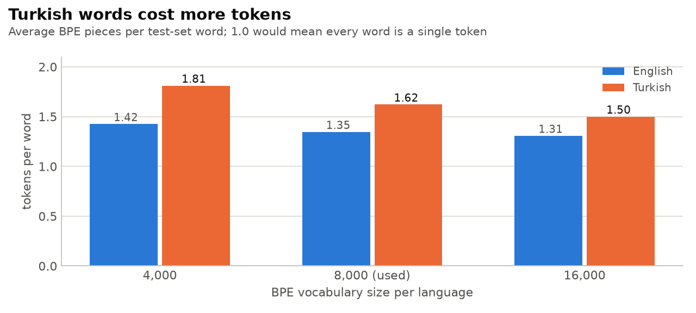
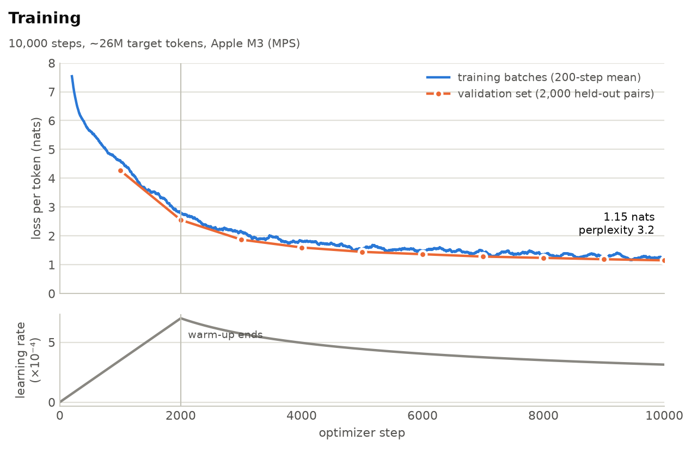
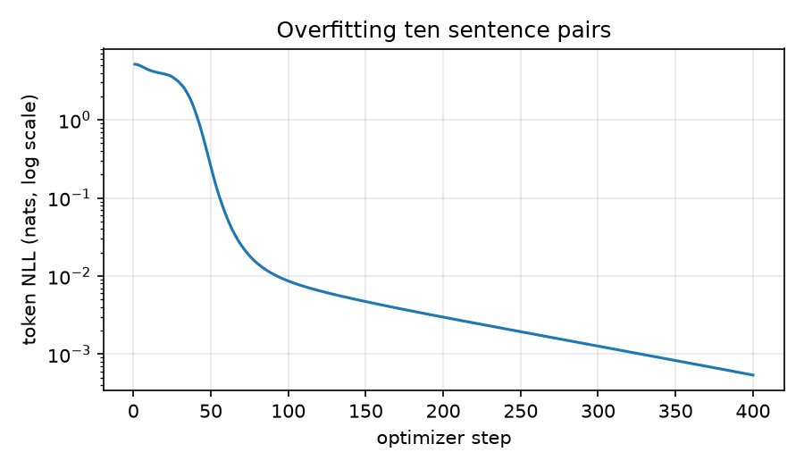

How do you prove a decoder cannot see the future, and what is BLEU actually measuring when the target language builds words out of stacked suffixes?

# transformer-from-scratch

[](https://github.com/beriltatli/transformer-from-scratch/actions/workflows/ci.yml)


A Transformer encoder-decoder written from primitives, trained English to Turkish on a laptop.

Every piece that matters is hand-written: attention, masks, positional encodings, the encoder and decoder, the BPE tokenizer, the learning-rate schedule, the loss and the batching. `torch.nn.MultiheadAttention` and Hugging Face `tokenizers` appear only inside the tests, as references to check against.

> [!NOTE]
> **In one sentence:** a 9.6M-parameter model, trained for 34 minutes on an 8 GB MacBook Air, translates short everyday English sentences into Turkish well enough that 22% of its outputs on unseen test sentences are identical to the human translation. It beats every simple baseline by a wide margin, and the margin is *largest* on sentences that look nothing like the training data.

---

## Contents

- [What it does](#what-it-does)
- [Results at a glance](#results-at-a-glance)
- [Is it translating or memorising?](#is-it-translating-or-memorising)
- [What the scores mean](#what-the-scores-mean)
- [Example translations](#example-translations)
- [How it works](#how-it-works)
- [Why Turkish is hard](#why-turkish-is-hard)
- [Training](#training)
- [How we know the code is right](#how-we-know-the-code-is-right)
- [Data](#data)
- [Reproduce it](#reproduce-it)
- [Project layout](#project-layout)
- [Limitations](#limitations)
- [Glossary](#glossary)
- [References](#references)

---

## What it does

You give it an English sentence, it writes the Turkish one, one piece at a time.

| English (input) | Model output | Human reference |
|---|---|---|
| Where did you threaten them? | Onları nerede tehdit ettin? | Onları nerede tehdit ettin? |
| It's impossible to see Rome in a day. | Bir gün Roma'yı görmek imkansız. | Roma'yı bir günde görmek imkansız. |
| Sami didn't respond to Layla's texts. | Sami, Leyla'nın mesajına cevap vermedi. | Sami, Leyla'nın mesajlarına cevap vermedi. |

The model has never seen these sentences. It was trained on 672,157 other English-Turkish pairs from [Tatoeba](https://tatoeba.org), a crowd-sourced collection of short everyday sentences.

---

## Results at a glance

Four systems translate the same 2,000 held-out test sentences. Three of them are deliberately simple baselines. They tell you what a score *means*: if a trivial method gets close to the model, the model is not doing much.

<picture>
  <source media="(prefers-color-scheme: dark)" srcset="figures/scores.dark.png">
  
</picture>

| System | What it does | chrF++ ↑ | chrF ↑ | BLEU ↑ | TER ↓ | Median sentence chrF++ | Worst 10% (mean) |
|---|---|---:|---:|---:|---:|---:|---:|
| **Transformer** | This project | **66.3** | **68.5** | **43.3** | **40.9** | **68.6** | **22.6** |
| Retrieval | Finds the most similar English sentence in the training data and returns *its* Turkish translation | 43.0 | 46.0 | 16.9 | 70.0 | 42.2 | 10.0 |
| Dictionary | Replaces each English word with the Turkish word it most often appears alongside | 33.0 | 36.1 | 1.4 | 130.0 | 31.6 | 13.8 |
| Copy source | Returns the English sentence unchanged | 11.2 | 11.4 | 0.3 | 131.3 | 10.0 | 6.2 |

↑ higher is better, ↓ lower is better. All scores come from [sacrebleu](https://github.com/mjpost/sacrebleu) 2.6.0. The signatures are in [`results/eval.json`](results/eval.json); the chrF++ signature is `nrefs:1|case:mixed|eff:yes|nc:6|nw:2|space:no|version:2.6.0`.

Other things worth knowing:

- **442 of 2,000** model outputs (22.1%) match the reference character for character. Retrieval matches **0**: no test sentence appears in the training data.
- **0 of 2,000** outputs hit the length cap (`2 × source length + 10` tokens). Every translation ended on its own.

<details>
<summary><b>Why does Copy source score 11 and not 0?</b></summary>

Names, numbers and punctuation are the same in both languages. "Tom", "Mary", "?" and "." are free character matches. That 11 is the floor every score in this table stands on.
</details>

---

## Is it translating or memorising?

This is the question a single score cannot answer. Tatoeba is full of near-repeats ("I'm tired." / "I am tired." / "I'm so tired."), so a model could score well just by recalling training sentences.

To check, the test set is split in two. **463** test sentences have a training sentence that is at least 90% similar (difflib ratio on lower-cased words). The other **1,537** do not.

<picture>
  <source media="(prefers-color-scheme: dark)" srcset="figures/near_duplicates.dark.png">
  
</picture>

| Median sentence chrF++ | No close match (1,537) | Close match (463) | Gap |
|---|---:|---:|---:|
| Transformer | 66.7 | 74.2 | +7.5 |
| Retrieval | 36.5 | 63.6 | **+27.1** |
| **Transformer's lead over retrieval** | **+30.2** | +10.6 | |

**How to read it:**

- **Retrieval is pure memory.** It is decent when a near-copy exists (63.6) and poor when one does not (36.5).
- **The transformer barely cares.** It gains only 7.5 points from having a near-copy.
- **Its lead is three times larger where memory cannot help.** That is the signature of a model that has learned to translate, not to look things up.

Second check: the [Spearman rank correlation](#glossary) between the model's per-sentence score and the retrieval similarity of that sentence is **0.24**. That is a weak link. How well the model does on a sentence is mostly *not* explained by how close the training data comes to it.

<details>
<summary><b>Caveat on the near-duplicate count</b></summary>

The near-duplicate search compares each test sentence only against training sentences that share its rarest word. It can miss a near-duplicate that differs in exactly that word, so 463 is a lower bound. See `near_duplicates` in [`scripts/prepare_data.py`](scripts/prepare_data.py).
</details>

---

## What the scores mean

All four metrics compare the model's output with **one** human translation. A perfectly good translation worded differently from the reference still loses points.

| Metric | Compares | In plain words | Range |
|---|---|---|---|
| **chrF++** (headline) | character 1–6-grams + word 1–2-grams | "How many letter sequences and word pairs do the two sentences share?" | 0–100 |
| chrF | character 1–6-grams only | Same, without the word part. The chrF++ − chrF gap shows how much word order contributes. | 0–100 |
| BLEU | word 1–4-grams | "How many whole words and word sequences match exactly?" | 0–100 |
| TER | word edits | "How many insertions, deletions, substitutions and shifts turn the output into the reference?" (per 100 reference words) | 0 → ∞ |

### Why chrF++ is the headline, not BLEU

Turkish builds words by stacking suffixes. *gel-e-me-yeceğ-im* means "I won't be able to come", all in one word. Change one suffix and BLEU sees a completely different word:

| Output | Reference | Meaning | Sentence BLEU | Sentence chrF++ |
|---|---|---|---:|---:|
| gelemeyeceksin | gelemeyeceğim | "you won't be able to come" vs "I won't…" | **0.0** | **60.5** |
| Tom'un derslerine ihtiyacı yoktu. | Tom'un derslere ihtiyacı yoktu. | "his lessons" vs "lessons" | 42.7* | 82.5 |

\* Sentence BLEU with effective order. The first row is a test case in [`tests/test_eval.py`](tests/test_eval.py).

BLEU gives zero credit for the shared stem *gelemeyece-*. chrF++ gives partial credit. This is why the dictionary baseline scores **33.0 chrF++ but 1.4 BLEU**: it often gets the right stem with the wrong ending, and almost never produces four correct words in a row.

> [!WARNING]
> **Corpus BLEU can be 0 for a perfect translation.** When no sentence is four or more tokens long, there are no 4-grams to match, and BLEU's geometric mean collapses. On Tatoeba, where the median Turkish test sentence is five words, this is not a curiosity. There is a test for it: `test_corpus_bleu_is_zero_for_a_perfect_copy_of_short_sentences`.

### The spread behind the average

<picture>
  <source media="(prefers-color-scheme: dark)" srcset="figures/sentence_scores.dark.png">
  
</picture>

- **The tall bar on the right** is the 442 exact matches.
- **Retrieval** is spread almost flat: it is a coin toss whether its borrowed sentence fits.
- **The transformer's worst 10%** average 22.6. The bottom of the list is idioms, rare words and a few wrong references; see the failures below.

---

## Example translations

**Good**

| English | Model | Reference | chrF++ |
|---|---|---|---:|
| Where did you threaten them? | Onları nerede tehdit ettin? | Onları nerede tehdit ettin? | 100.0 |
| Sami didn't respond to Layla's texts. | Sami, Leyla'nın mesajına cevap vermedi. | Sami, Leyla'nın mesajlarına cevap vermedi. | 83.3 |
| Tom didn't need lessons. | Tom'un derslerine ihtiyacı yoktu. | Tom'un derslere ihtiyacı yoktu. | 82.5 |

**Correct, but worded differently from the reference** (the metric undersells these)

| English | Model | Reference | chrF++ |
|---|---|---|---:|
| It's impossible to see Rome in a day. | Bir gün Roma'yı görmek imkansız. | Roma'yı bir günde görmek imkansız. | 66.6 |
| How long have you and Tom been roommates? | Ne kadar süredir sen ve Tom oda arkadaşısınız? | Sen ve Tom ne kadar süredir oda arkadaşlarısınız? | 63.0 |
| Tom and Mary still liked each other. | Tom ve Mary hâlâ birbirlerini sevdiler. | Tom ve Mary hala birbirlerinden hoşlanıyordu. | 46.1 |

**Failures** (the bottom of the test set)

| English | Model | Reference | chrF++ | What went wrong |
|---|---|---|---:|---|
| I hit the jackpot. | Ben çörek vurdum. | Büyük ikramiyeyi kazandım. | 8.3 | Idiom translated word by word ("I hit a bun") |
| Horses for courses, or courses for horses? | Atlar için kurslar, atlar için ya da atlarlar için? | İşe göre adam mı, adama göre iş mi? | 9.0 | Proverb; needs a cultural equivalent |
| Don't even bother! | Merak etme! | Hiç boşuna uğraşma! | 7.4 | Fluent, but means "Don't worry!" |
| Arrests were made throughout the country. | Evrit ülke boyunca yapıldı. | Yurt çapında tutuklamalar gerçekleştirildi. | 9.4 | Rare word → invented a non-word from subword pieces |
| Tom walked down the hall alone. | Tom salonu yalnız bıraktı. | Hol boyunca tek başıma yürüdüm. | 9.8 | Model is wrong ("Tom left the hall alone"), **and** the reference is wrong ("I walked…") |

All 2,000 outputs of every system are in [`results/`](results/).

---

## How it works

### The pipeline



### The model

An encoder reads the whole English sentence at once. A decoder writes the Turkish sentence one token at a time. At each step it looks at everything it has written so far (self-attention) and at the English sentence (cross-attention).



| Setting | Value | Why |
|---|---|---|
| Layers | 3 encoder + 3 decoder | Scaled down from "Transformer base" (6 + 6 layers, width 512) to fit 8 GB of unified memory |
| Model width `d_model` | 256 | |
| Attention heads | 4 (64 dims each) | |
| Feed-forward width | 1,024 | 4 × `d_model`, as in the original paper |
| Normalisation | **Pre-norm** (LayerNorm before each sub-layer) | Better-behaved gradients at initialisation (Xiong et al., 2020); switchable to post-norm |
| Positions | Sinusoidal | `learned` and `none` are also implemented, for ablations |
| Embedding scale | × √256 = 16 | Without it, token identity is ~16× quieter than the position signal |
| Output layer | Tied to target embeddings | Saves 2M parameters |
| Dropout | 0.1 | |
| Parameters | **9,626,624** | |

### Decoding

Decoding is **greedy**: at every step, take the single most likely next piece. The output length is capped at `2 × source tokens + 10`. There is no beam search and no KV cache. Each step re-runs the decoder over the whole prefix, which is O(T²) but fine for sentences this short.

---

## Why Turkish is hard

Turkish is **agglutinative**: one Turkish word often carries what English spreads over several. *Anahtarlarımı gördün mü?* is "Did you see my keys?", where *anahtar-lar-ım-ı* = key-PLURAL-MY-OBJECT.

| Training corpus | English | Turkish |
|---|---:|---:|
| Words | 4,460,349 | 3,291,119 (0.74 per English word) |
| Distinct words | 33,353 | **128,170** (3.8×) |
| Type-token ratio (first 200k words) | 0.045 | **0.140** |
| Test word types never seen in training | 1.7% | **5.2%** |

Turkish has fewer words, but almost four times as many *different* words. A word-level vocabulary would be hopeless: 5% of Turkish test word types would be unknown. **Byte-pair encoding (BPE)** fixes this by splitting rare words into frequent pieces, so the model can assemble words it has never seen.

<picture>
  <source media="(prefers-color-scheme: dark)" srcset="figures/tokens_per_word.dark.png">
  
</picture>

| BPE vocabulary | Tokens per word (en / tr) | Words kept as a single token (en / tr) |
|---:|---:|---:|
| 4,000 | 1.42 / 1.81 | 85% / 59% |
| **8,000 (used)** | **1.35 / 1.62** | **94% / 69%** |
| 16,000 | 1.31 / 1.50 | 96% / 82% |

At 8,000 pieces, almost every English word is one token, but nearly a third of Turkish words are split. BPE knows nothing about grammar, though. Common suffixes such as *-lar*, *-ler*, *-iyor* are in the vocabulary, yet they end up as the word's final piece far less often than a linguist would split them (*-ler* 49%, *-den* 15%, *-iyorum* 1%). BPE merges whatever is frequent, and a frequent stem+suffix often fuses into one piece.

---

## Training

<picture>
  <source media="(prefers-color-scheme: dark)" srcset="figures/training.dark.png">
  
</picture>

| Step | 1,000 | 2,000 | 3,000 | 4,000 | 5,000 | 6,000 | 7,000 | 8,000 | 9,000 | 10,000 |
|---|---:|---:|---:|---:|---:|---:|---:|---:|---:|---:|
| Validation loss (nats/token) | 4.27 | 2.55 | 1.87 | 1.60 | 1.45 | 1.36 | 1.28 | 1.24 | 1.19 | **1.15** |
| Validation perplexity | 71.5 | 12.9 | 6.5 | 4.9 | 4.2 | 3.9 | 3.6 | 3.4 | 3.3 | **3.2** |

**Reading the curves:**

- **Perplexity 3.2** means that, on held-out sentences, the model is on average about as uncertain as if it were choosing between 3.2 equally likely next pieces, out of 8,000.
- **Validation is still falling at step 10,000.** The model is under-trained, not over-fitted; more steps would help.
- **The training curve sits *above* validation.** Training batches are measured with dropout on, which makes the model worse at that moment. Validation is measured with dropout off.

| Hyperparameter | Value |
|---|---|
| Optimiser | Adam, β = (0.9, 0.98), ε = 1e-9 |
| Learning rate | linear warm-up to 7e-4 over 2,000 steps, then × √(2000 / step) |
| Batch | ≤ 4,096 padded positions (≈ 2,600 real target tokens) |
| Steps | 10,000 (≈ 4.3 passes over the data, 25.8M target tokens) |
| Loss | cross-entropy with label smoothing 0.1 |
| Gradient clipping | global norm 1.0 |
| Hardware | Apple M3, 8 GB unified memory, PyTorch MPS backend |
| Wall-clock | ≈ 34 min of compute, ≈ 190 ms per step |

<details>
<summary><b>Engineering for an 8 GB laptop</b></summary>

| Problem | Fix |
|---|---|
| A batch of 8,192 tokens didn't fit in memory and stalled in swap | 4,096 padded positions per batch |
| The tokenised corpus as Python lists took ~36 bytes per token | Stored as `int16` NumPy arrays, 2 bytes per token |
| On MPS, every new tensor shape compiles a new kernel (0.5–2 s each) | Lengths are padded up to a multiple of 8, and each (source, target) length bucket gets a fixed row count, so the whole run uses a few dozen shapes |
| The dictionary baseline's co-occurrence `Counter` over ~20M word pairs didn't fit | Pairs packed into single `int64` keys and counted with `np.unique` |
| Retrieval's full train × test similarity matrix is 5 GB | Sparse CSR matrix, queried 64 sentences at a time |
| macOS idle sleep on battery silently paused training for ~9 minutes, twice | Run under `caffeinate -i` |
</details>

---

## How we know the code is right

A translation model with a subtle bug often still trains and still produces plausible Turkish, just worse. So correctness is checked **directly**, not inferred from the loss going down. There are **281 tests**, and all run in CI except one slow, training-scale test.

| Claim | How it's proven | Test file |
|---|---|---|
| **The decoder cannot see the future** | Gradient of output *t* with respect to every input position > *t* is **exactly zero** (not "close to"), across head counts, layer counts, padding, pre/post-norm and every position type. Changing future tokens leaves past logits **bit-identical**. | `test_causal_leakage.py` |
| …and that test would catch a real bug | Deliberately broken attention (missing mask, off-by-one diagonal, heads split without transpose, a soft mask that `allclose` would miss) is caught every time | `test_causal_leakage.py` |
| **Batch elements don't see each other** | Same gradient test, across the batch dimension | `test_causal_leakage.py` |
| **Padding changes nothing** | A sentence run alone and run in a padded batch give the same output, with pad positions filled with large noise rather than zeros so an unmasked pad cannot hide | `test_padding_invariance.py` |
| **Attention is numerically right** | Matches `torch.nn.MultiheadAttention` across head counts and mask kinds | `test_attention_vs_torch.py` |
| **Masks are strict** | Wrong dtype or shape is rejected rather than silently broadcast. A fully masked row gives zero weights and finite gradients. | `test_masks.py` |
| **BPE is a faithful implementation** | Reproduces Sennrich et al.'s toy merges, matches Hugging Face `tokenizers` merge order, round-trips text losslessly, handles Turkish dotted/dotless *i* | `test_bpe.py` |
| **Positions and schedule match the paper** | Sinusoidal values, and the dot product depends only on offset. LR matches Vaswani et al.'s formula. | `test_positions_schedule.py` |
| **Loss and batching are right** | Unsmoothed loss equals `F.cross_entropy`. Every example appears once per epoch, within the token budget. | `test_train.py` |
| **Metrics are what they claim** | Signatures present, known edge cases (zero BLEU on short sentences, partial chrF++ credit for suffixes), tie-aware ranks | `test_eval.py` |
| **The whole thing can learn** | Ten sentence pairs memorised to near-zero loss and regenerated exactly (slow test) | `test_overfit.py` |

The overfit check is the cheapest bug detector: a model that cannot memorise ten sentences has a bug, and finding it takes seconds instead of a 30-minute training run.

<p align="center"></p>

---

## Data

[Tatoeba](https://tatoeba.org) English–Turkish, via [OPUS](https://opus.nlpl.eu/) (release v2023-04-12).

| Stage | Pairs |
|---|---:|
| Raw | 676,920 |
| After cleaning (whitespace, Unicode NFC, ≤ 40 words per side, exact duplicates removed) | 676,723 |
| Connected groups (see below) | 593,189 |
| **Train** | **672,157** |
| **Validation** (one pair per group) | **2,000** |
| **Test** (one pair per group) | **2,000** |

**Splitting without leaks.** Tatoeba links one English sentence to several Turkish translations, and one Turkish sentence to several English paraphrases. A naive split would put *"Yorgunum."* in the test set under *"I am tired."* and in training under *"I'm tired."*.

To prevent this, pairs are grouped into **connected components** over both languages (union-find on normalised text), and whole groups are assigned to a split. The largest group has 257 pairs.

| Leak check on the test set | Count |
|---|---:|
| Test source appears exactly in training | **0** |
| Test target appears exactly in training | **0** |
| Test source ≥ 90% similar to a training source | 463 (lower bound) |

---

## Reproduce it

```bash
git clone https://github.com/beriltatli/transformer-from-scratch
cd transformer-from-scratch
python3.12 -m venv .venv && source .venv/bin/activate
pip install -r requirements.txt

pytest -m "not slow"                 # 280 tests, a few seconds
pytest -m slow                       # the ten-pair overfit check

python -m scripts.prepare_data       # download, clean, split → data/
python -m scripts.corpus_stats       # corpus + tokenizer statistics
python -m scripts.train              # ~35 min on an M3; → checkpoints/model.pt
python -m scripts.evaluate           # model + baselines on test → results/
python -m scripts.make_figures       # README figures → figures/
```

> [!TIP]
> On a macOS laptop, run training as `caffeinate -i python -m scripts.train`. Otherwise idle sleep can pause it without any error.

All settings live in [`config.yaml`](config.yaml). The device is picked automatically: CUDA, then MPS, then CPU.

---

## Project layout

```text
model/          attention, masks, positions, encoder, decoder, transformer, LR schedule
tokenizer/      BPE (training, encode/decode) and corpus statistics
decode/         greedy decoding with per-sentence length caps
baselines/      copy-source, Dice-coefficient dictionary, TF-IDF retrieval
eval/           sacrebleu wrappers (with signatures) and score distributions
scripts/        prepare_data, corpus_stats, train, overfit, evaluate, make_figures
tests/          281 tests, see "How we know the code is right"
results/        eval.json and every system's test translations
figures/        README figures (light and dark versions)
config.yaml     every hyperparameter in one place
```

---

## Limitations

- **Short, simple sentences.** Tatoeba is phrasebook language: the median test sentence is 6 English / 5 Turkish words. These scores say nothing about news, legal text or long documents.
- **One reference per sentence.** Valid paraphrases are scored as errors. The "worded differently" examples above lose 35–55 points for being correct.
- **Noisy references.** Some Tatoeba translations are wrong. The "Tom walked down the hall" reference says "I walked".
- **Greedy decoding only.** Beam search would likely add a few points.
- **Under-trained.** Validation loss was still falling at the last step.
- **One run, one seed.** No error bars yet. Differences of a point or two between configurations should not be read as real.
- **Ablations are wired but not yet run.** Positions, pre/post-norm, embedding scaling and warm-up ramp are all switchable in `config.yaml`.

---

## Glossary

| Term | Meaning |
|---|---|
| **Token / piece** | The unit the model reads and writes. Here, a BPE subword: a whole common word, or a fragment of a rare one. |
| **BPE** | Byte-pair encoding. Starts from characters and repeatedly merges the most frequent adjacent pair until the vocabulary reaches a target size. |
| **Encoder / decoder** | The encoder turns the English sentence into vectors; the decoder generates Turkish from them, one token at a time. |
| **Attention** | Each position computes a weighted average over other positions, with weights from how well a query matches each key: softmax(QKᵀ/√d)V. |
| **Causal mask** | Stops decoder position *t* from attending to positions after *t*, so training can't cheat by looking at the answer. |
| **Teacher forcing** | During training, the decoder is fed the *correct* previous tokens, not its own guesses. |
| **NLL / loss (nats)** | Negative log-probability the model gave the correct next token, averaged over tokens. Lower is better. |
| **Perplexity** | e^NLL. Roughly "how many choices the model is torn between" at each step. |
| **Label smoothing** | Training target puts 90% on the correct token and spreads 10% over the rest, discouraging over-confidence. |
| **Warm-up** | Starting with a tiny learning rate and ramping up, because Adam's early estimates are unreliable. |
| **Greedy decoding** | Always pick the single most likely next token. |
| **Spearman correlation** | Correlation between rankings, from −1 to 1. 0.24 is a weak positive relationship. |

---

## References

- Vaswani et al. (2017). [Attention Is All You Need](https://arxiv.org/abs/1706.03762). The architecture, sinusoidal positions and LR schedule.
- Sennrich, Haddow & Birch (2016). [Neural Machine Translation of Rare Words with Subword Units](https://arxiv.org/abs/1508.07909). BPE.
- Xiong et al. (2020). [On Layer Normalization in the Transformer Architecture](https://arxiv.org/abs/2002.04745). Pre-norm.
- Popović (2017). [chrF++: words helping character n-grams](https://aclanthology.org/W17-4770/).
- Post (2018). [A Call for Clarity in Reporting BLEU Scores](https://aclanthology.org/W18-6319/). sacrebleu and signatures.
- Tiedemann (2012). [Parallel Data, Tools and Interfaces in OPUS](https://aclanthology.org/L12-1246/).
- [Tatoeba](https://tatoeba.org), sentences under CC BY 2.0 FR.

## License

Code: [MIT](LICENSE). Data: Tatoeba, CC BY 2.0 FR. Not redistributed here; `scripts/prepare_data.py` downloads it.
